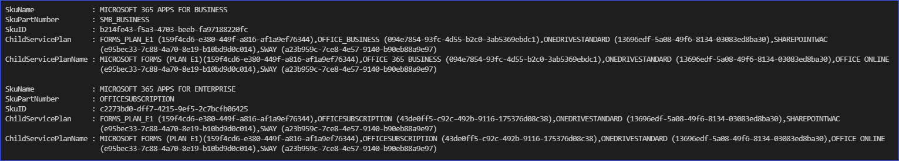
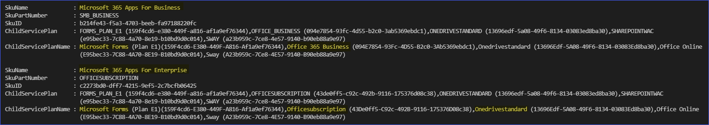
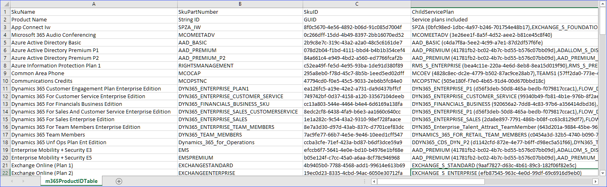

# Microsoft 365 License Friendly Names
Get license IDs and friendly names directly from MS article source in GitHub that Microsoft maintains.

## How to Get

Download or clone the script from this repository or install from PowerShell gallery.

```PowerShell
Install-Script -Name Get-m365ProductIDTable
```


## Example 1: Get the Product Names and Service Plan Identifiers Online

```PowerShell
.\Get-m365ProductIDTable.ps1
```



## Example 2: Get the Product Names and Service Plan Identifiers Online and Convert Names to Title Case

```PowerShell
.\Get-m365ProductIDTable.ps1 -TitleCase
```



## Example 3: Get the Product Names and Service Plan Identifiers Online, Convert Names to Title Case, and Export to CSV

```PowerShell
.\Get-m365ProductIDTable.ps1 -TitleCase | Export-Csv -NoTypeInformation -Path .\m365ProductIDTable.csv
```

